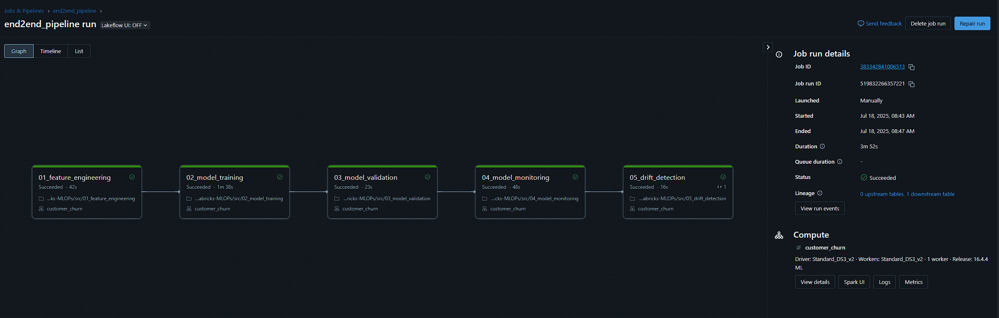
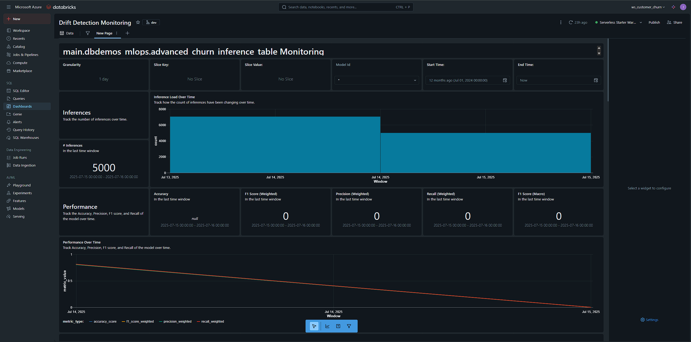

# Databricks-MLOps (Customer Churn)

This project contains notebooks and code for building a full MLOps pipeline in Azure Databricks by leveraging the Databricks Lakehouse to orchestrate and deploy trained models in production.

## Steps
1. Ingested data is preprocessed and features are stored in a feature store
2. ML models are built using Databricks notebooks and MLFlow
3. MLflow is used to automatically evaluate models using business metric (Revenue Impact)
4. Validated models are automatically moved deployed to production
5. Model is retrained periodically to prevent Data Drift

## Business Metric (Revenue Impact)

To evaluate model performance beyond traditional metrics like F1 score, we use a custom revenue impact metric that quantifies the financial value of churn predictions. This metric assigns dollar values to each prediction outcome based on retention costs and churn losses:

- False Negatives (FN): Cost $5,000 — a missed churn prediction results in full churn loss.
- True Positives (TP): Save $4,000 — churn is predicted and customer is retained via a $1,000 discount.
- False Positives (FP): Cost $1,000 — unnecessary discount given to a non-churning customer.
- True Negatives (TN): No cost.

The total revenue gain is calculated from the confusion matrix, helping compare models by estimated financial impact, not just predictive accuracy.

### - End2End Intial Model Training Pipeline

### - Drift Detection Pipeline

### - Drift Detection Monitoring using an Online Inference Table
